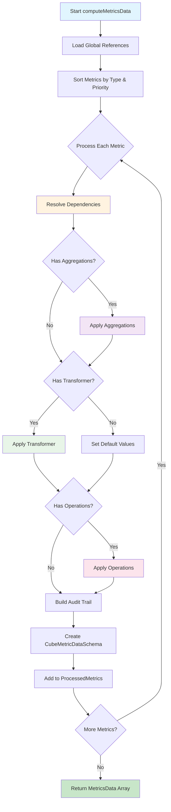

# Cube Metrics System API Documentation v1.0

## Overview

The Cube Metrics System is a high-performance financial and operational metrics computation engine that transforms time-series cube source data into scalar business metrics. It features declarative configuration, dependency resolution, aggregation functions, custom transformers, and sensitivity analysis capabilities.

### Dependency Access Patterns
Transformers access all data through the consolidated `dependencies` object:

```javascript
// ✅ Source data access (per percentile)
const netCashflowP50 = dependencies.sources.netCashflow[50].data;
const totalCostP75 = dependencies.sources.totalCost[75].data;

// ✅ Metric data access (previously computed metrics)
const projectIRRMetric = dependencies.metrics.projectIRR;
const equityIRRValue = projectIRRMetric.percentileMetrics.find(pm => pm.percentile.value === 50)?.value;

// ✅ Reference data access (consolidated global + local)
const discountRate = dependencies.references.financing.costOfEquity;
const projectLife = dependencies.references.projectLife;
const customSetting = dependencies.references.localCustomSetting; // From dependency path

// ✅ Context access
const { availablePercentiles, aggregationResults, addAuditEntry } = context;
```

**Performance Benefits**:
- **O(1) Metric Lookups**: Direct object access instead of array.find()
- **Consolidated References**: Single object for all reference access
- **Simplified Interface**: Cleaner function signatures with fewer parameters
- **Reduced Redundancy**: No duplicate data passing between functions

## Parameterized Aggregations

### Function-Based Parameters
Advanced aggregation operations support dynamic parameters resolved through function callbacks.

**Parameter Resolution**:
- Parameters are resolved **once per metric** (not per percentile)
- Functions receive access to global references and processed metrics
- Parameter values are cached for all percentiles of the metric

**Parameter Function Signature**: `(refs, metrics) => parameterValue`

### NPV Aggregation
Net Present Value calculation with parameterized discount rate.

```javascript
{
  sourceId: 'netCashflow',
  operation: 'npv',
  outputKey: 'riskAdjustedNPV',
  parameters: {
    discountRate: (refs, metrics) => {
      const baseRate = refs.financing.costOfEquity / 100;
      const riskPremium = refs.riskAssessment?.premium || 0;
      return baseRate + (riskPremium / 100);
    }
  },
  filter: (year, value, refs) => year >= 0
}
```

### Custom Reduce Aggregation
Flexible reducer function for complex calculations.

```javascript
{
  sourceId: 'netCashflow',
  operation: 'reduce',
  outputKey: 'weightedAverage',
  parameters: {
    reducer: (refs, metrics) => {
      const weightMultiplier = refs.analysisSettings?.weightMultiplier || 1;
      return (accumulator, currentDataPoint, index, array) => {
        const weight = (currentDataPoint.year + 1) * weightMultiplier;
        const weightedValue = currentDataPoint.value * weight;
        
        if (index === 0) {
          return { totalWeightedValue: weightedValue, totalWeight: weight };
        }
        
        if (index === array.length - 1) {
          // Final calculation
          const finalTotal = accumulator.totalWeightedValue + weightedValue;
          const finalWeight = accumulator.totalWeight + weight;
          return finalTotal / finalWeight;
        }
        
        return {
          totalWeightedValue: accumulator.totalWeightedValue + weightedValue,
          totalWeight: accumulator.totalWeight + weight
        };
      };
    },
    initialValue: (refs, metrics) => ({ totalWeightedValue: 0, totalWeight: 0 })
  }
}
```

**Required Parameters**:
- **NPV**: `discountRate` - Discount rate as decimal (e.g., 0.08 for 8%)
- **Reduce**: `reducer` - Function with signature `(accumulator, currentDataPoint, index, array) => accumulator`
- **Reduce**: `initialValue` - Initial accumulator value (optional, defaults to undefined)

### Error Handling
```javascript
// Missing required parameter
Error: NPV operation requires 'discountRate' parameter for 'npvCashflow'

// Parameter resolution failure  
Error: Failed to resolve parameter 'discountRate' for aggregation 'npvCashflow': Cannot read property 'costOfEquity' of undefined
```

## Core Processing API

### `computeMetricsData()`
Main processing pipeline that transforms metrics registry configuration into computed metric data with full audit trails and performance tracking.

**Parameters**:
```javascript
computeMetricsData(
  metricsRegistry,      // CubeMetricsRegistrySchema
  availablePercentiles, // number[] - [10, 25, 50, 75, 90]
  getValueByPath,       // Function - (path: string[]) => any
  getSourceData,        // Function - (filters) => sourceData
  customPercentile      // Object|null - {sourceId: percentileValue}
)
```

**Returns**: `CubeMetricDataSchema[]`
```javascript
// Array of computed metrics with audit trails
[
  {
    id: 'projectIRR',
    valueType: 'scalar',
    percentileMetrics: [
      { percentile: {value: 50}, value: 12.5, stats: {min: 8.2, max: 18.7} }
    ],
    metadata: { name: 'Project IRR', type: 'direct', ... },
    audit: { trail: [...], references: {...} }
  }
]
```

**Example Usage**:
```javascript
const metricsData = computeMetricsData(
  METRICS_REGISTRY,
  [10, 25, 50, 75, 90],
  getValueByPath,
  getData,
  {"escalationRate": 25}
);
```

### Payback Period Transformer
```javascript
/**
 * Calculate payback period from cumulative cashflow with linear interpolation
 * @param {Object} dependencies - Resolved dependencies
 * @param {Object} context - Transformer context
 * @returns {Array} Array of CubeMetricResultSchema objects
 */
export const calculatePaybackPeriod = (dependencies, context) => {
  const { availablePercentiles, addAuditEntry } = context;

  // Validate required source dependency
  if (!dependencies.sources.cumulativeCashflow) {
    throw new Error('Payback period calculation requires cumulativeCashflow source dependency');
  }

  const results = [];

  // Process each percentile separately
  availablePercentiles.forEach(percentile => {
    const cumulativeCashflowData = dependencies.sources.cumulativeCashflow[percentile];
    
    if (!cumulativeCashflowData?.data) {
      results.push({
        percentile: { value: percentile },
        value: dependencies.references.projectLife || 25, // Fallback to project life
        stats: {}
      });
      return;
    }

    const timeSeriesData = cumulativeCashflowData.data;
    const sortedData = [...timeSeriesData].sort((a, b) => a.year - b.year);
    
    let paybackPeriod = dependencies.references.projectLife || 25;
    
    // Find first year where cumulative cashflow becomes positive
    for (let i = 0; i < sortedData.length; i++) {
      const currentDataPoint = sortedData[i];
      
      if (currentDataPoint.value > 0) {
        if (i === 0) {
          paybackPeriod = currentDataPoint.year;
        } else {
          // Linear interpolation for sub-year precision
          const prevDataPoint = sortedData[i - 1];
          if (prevDataPoint.value < 0) {
            const fraction = Math.abs(prevDataPoint.value) / 
                           (currentDataPoint.value - prevDataPoint.value);
            paybackPeriod = prevDataPoint.year + fraction;
          } else {
            paybackPeriod = currentDataPoint.year;
          }
        }
        break;
      }
    }

    results.push({
      percentile: { value: percentile },
      value: Math.round(paybackPeriod * 100) / 100, // Round to 2 decimal places
      stats: {}
    });

    addAuditEntry('payback_period_calculated',
      `calculated payback period ${paybackPeriod} years for percentile ${percentile}`,
      ['cumulativeCashflow']);
  });

  return results;
};
```

**Registry Configuration**:
```javascript
{
  id: 'paybackPeriod',
  dependencies: [
    { id: 'cumulativeCashflow', type: 'source' }
  ],
  aggregations: [],
  transformer: calculatePaybackPeriod,
  operations: [],
  metadata: {
    name: 'Payback Period',
    type: 'direct',
    description: 'Years to recover initial investment with linear interpolation',
    formatter: (value) => `${value.toFixed(1)} years`
  }
}
```

## Processing Flow Map



### Processing Order
1. **Direct Metrics** (type: 'direct') - Dependencies are sources only
2. **Indirect Metrics** (type: 'indirect') - Dependencies include other metrics

Within each type, metrics are processed by ascending priority value.

---

## Registry Configuration

### Metrics Registry Schema
Complete configuration structure for defining metrics with all features.

```javascript
const METRICS_REGISTRY = {
  references: [
    { id: 'financing', path: ['settings', 'modules', 'financing'] }
  ],
  
  metrics: [
    {
      id: 'minDSCR',
      priority: 200,
      dependencies: [
        { id: 'dscr', type: 'source' },
        { id: 'financing', type: 'reference' }
      ],
      aggregations: [
        { 
          sourceId: 'dscr', 
          operation: 'min', 
          outputKey: 'minValue', 
          isDefault: true,
          filter: (year, value, refs) => year > refs.financing.gracePeriod
        }
      ],
      transformer: calculateMinDSCR,
      operations: [
        {
          id: 'riskAdjustment',
          operation: (baseValue, percentile, adjustmentValue, refs) => {
            return baseValue * (1 + adjustmentValue / 100);
          }
        }
      ],
      metadata: {
        name: 'Minimum DSCR',
        type: 'direct',
        visualGroup: 'risk',
        description: 'Minimum debt service coverage ratio during operational period',
        formatter: (value) => `${value.toFixed(2)}x`
      },
      sensitivity: {
        enabled: true,
        excludeSources: ['reserveFunds'],
        analyses: ['tornado', 'correlation']
      }
    }
  ]
}
```

---

## Dependency System

### Dependency Types
Three types of dependencies with different resolution strategies.

| Type | Resolution Strategy | Example |
|------|-------------------|---------|
| `source` | `getSourceData({sourceId})` | Time-series cube data |
| `metric` | Previously computed metrics | Other metric results |
| `reference` | `globalReferences[id]` or `getValueByPath(path)` | Scenario configuration |

### Dependency Configuration
```javascript
dependencies: [
  { id: 'netCashflow', type: 'source' },                    // From cube sources
  { id: 'projectIRR', type: 'metric' },                     // From processed metrics
  { id: 'financing', type: 'reference' },                   // From global references
  { id: 'discountRate', type: 'reference', path: ['settings', 'analysis', 'rate'] } // Local reference
]
```

---

## Aggregation System

### Aggregation Operations
Mathematical operations applied to time-series source data to produce scalar values.

| Operation | Description | Use Case | Parameters |
|-----------|-------------|----------|------------|
| `min` | Minimum value | Worst-case scenarios | None |
| `max` | Maximum value | Best-case scenarios | None |
| `mean` | Average value | Expected performance | None |
| `sum` | Total value | Cumulative amounts | None |
| `stdev` | Standard deviation | Variability analysis | None |
| `mode` | Most frequent value | Typical occurrences | None |
| `npv` | Net Present Value | Discounted cash flows | `discountRate` |
| `reduce` | Custom reducer function | Complex calculations | `reducer`, `initialValue` |

### Advanced Aggregation Example
```javascript
aggregations: [
  {
    sourceId: 'netCashflow',
    operation: 'npv',
    outputKey: 'npvCashflow',
    isDefault: true,
    parameters: {
      discountRate: (refs, metrics) => (refs.financing.costOfEquity || 8) / 100
    },
    filter: (year, value, refs) => {
      // Only operational years after grace period
      return year > refs.financing.gracePeriod && 
             year <= refs.financing.loanDuration + refs.financing.gracePeriod;
    }
  },
  {
    sourceId: 'dscr',
    operation: 'min',
    outputKey: 'worstDSCR',
    isDefault: false,
    filter: (year, value, refs) => year > 0 // Exclude construction
  },
  {
    sourceId: 'cumulativeCashflow',
    operation: 'reduce',
    outputKey: 'paybackPeriod',
    isDefault: false,
    parameters: {
      reducer: (refs, metrics) => {
        return (accumulator, currentDataPoint, index, array) => {
          if (currentDataPoint.value > 0 && accumulator === null) {
            return currentDataPoint.year;
          }
          return accumulator;
        };
      },
      initialValue: (refs, metrics) => null
    }
  }
]
```

**Filter Function Signature**: `(year, value, refs) => boolean`
- `year`: Data point year
- `value`: Data point value  
- `refs`: Combined global and local references

**Parameter Function Signature**: `(refs, metrics) => parameterValue`
- `refs`: Global references object
- `metrics`: Processed metrics dependencies object

---

## Transformer System

### Transformer Function Signature
Functions that convert dependencies into metric results with full context access.

```javascript
transformer(dependencies, context) => CubeMetricResultSchema[]

// Dependencies object structure (first parameter):
{
  sources: { [sourceId]: { [percentile]: { data: DataPointSchema[], metadata: {} } } },
  metrics: { [metricId]: CubeMetricDataSchema },
  references: { ...globalReferences, ...localReferences } // All references consolidated
}

// Context object structure (second parameter):
{
  availablePercentiles: number[],
  aggregationResults: CubeMetricResultSchema[],
  customPercentile: Object|null,
  addAuditEntry: Function
}
```

### Financial Transformer Example
```javascript
export const calculateProjectIRR = (dependencies, context) => {
  const { availablePercentiles, addAuditEntry } = context;
  
  return availablePercentiles.map(percentile => {
    // ✅ Direct access to source data for this percentile
    const netCashflowData = dependencies.sources.netCashflow[percentile].data;
    const totalCapexData = dependencies.sources.totalCapex[percentile].data;
    
    // ✅ Direct access to consolidated references
    const minimumIRR = dependencies.references.financing?.minimumIRR || 0;
    
    // Get initial investment from total CAPEX
    const initialInvestment = totalCapexData.find(d => d.year === 0)?.value || 0;
    
    // Build cashflow array starting with negative investment
    const cashflows = [
      { year: 0, value: -initialInvestment },
      ...netCashflowData.filter(d => d.year > 0)
    ];
    
    // Calculate IRR using Newton-Raphson method
    const irr = calculateIRR(cashflows);
    
    addAuditEntry('irr_calculation', 
      `calculated IRR ${irr.toFixed(2)}% for percentile ${percentile}`,
      ['netCashflow', 'totalCapex']);
    
    return {
      percentile: { value: percentile },
      value: Math.max(irr, minimumIRR),
      stats: {}
    };
  });
};
```

---

## Operations System

### Operations Configuration
Post-processing operations that modify metric results using other metrics or references.

```javascript
operations: [
  {
    id: 'equityIRR',
    operation: (projectIRRValue, percentile, equityIRRValue, references) => {
      // Calculate IRR spread: Equity IRR - Project IRR
      return equityIRRValue - projectIRRValue;
    }
  },
  {
    id: 'marketRate',
    operation: (baseValue, percentile, marketRate, references) => {
      // Risk premium over market rate
      return baseValue - marketRate;
    }
  }
]
```

**Operation Function Signature**: `(baseValue, percentile, targetValue, references) => number`
- `baseValue`: Current metric value
- `percentile`: Current percentile being processed
- `targetValue`: Value from target metric or reference
- `references`: Consolidated references object (global + local)

### Complex Operations Example
```javascript
// LCOE calculation using NPV metrics
{
  id: 'lcoe',
  dependencies: [
    { id: 'npvCosts', type: 'metric' },
    { id: 'npvEnergy', type: 'metric' }
  ],
  operations: [
    {
      id: 'npvEnergy',
      operation: (npvCostsValue, percentile, npvEnergyValue, references) => {
        // LCOE = NPV of Costs / NPV of Energy Production (MWh)
        if (npvEnergyValue <= 0) {
          console.warn(`Invalid NPV Energy for LCOE at P${percentile}: ${npvEnergyValue}`);
          return 0;
        }
        return npvCostsValue / npvEnergyValue;
      }
    }
  ]
}
```

---

## Default Values & Fallback Logic

### Automatic Value Assignment
When transformers are absent or return incomplete results, the system uses aggregation results as defaults.

```javascript
// Configuration
aggregations: [
  { sourceId: 'dscr', operation: 'min', outputKey: 'minValue', isDefault: false },
  { sourceId: 'dscr', operation: 'mean', outputKey: 'avgValue', isDefault: true },
  { sourceId: 'dscr', operation: 'max', outputKey: 'maxValue', isDefault: false }
]

// Result when no transformer
{
  percentile: { value: 50 },
  value: 1.35, // Uses 'avgValue' from aggregation (isDefault: true)
  stats: {
    minValue: 1.12,
    avgValue: 1.35,
    maxValue: 1.58
  }
}
```

### Fallback Hierarchy
1. **Transformer Result** (if transformer exists and returns valid value)
2. **Last isDefault: true Aggregation** (if multiple defaults exist)
3. **First Available Aggregation** (if no defaults specified)
4. **Zero Value** (if no aggregations available)

---

## Data Access Functions

### CubeContext Integration
Access computed metrics through the CubeContext with optimized filtering.

```javascript
const { getMetricsData } = useCube();

// Get all percentiles for one metric
const projectIRRData = getMetricsData({ metricId: 'projectIRR' });
// Returns: { 50: {value: 12.5, metadata}, 75: {value: 15.2, metadata} }

// Get all metrics for one percentile  
const medianMetrics = getMetricsData({ percentile: 50 });
// Returns: { projectIRR: {value: 12.5, metadata}, equityIRR: {value: 18.3, metadata} }

// Get specific metric-percentile combination
const specificData = getMetricsData({ metricId: 'projectIRR', percentile: 50 });
// Returns: { projectIRR: {value: 12.5, metadata} }
```

### Filter Options
| Filter | Type | Purpose |
|--------|------|---------|
| `metricId` | `string` | Single metric by ID |
| `percentile` | `number` | Single percentile across metrics |
| `metadata` | `Object` | Filter by metadata fields |

---

## Error Handling & Validation

### Comprehensive Error Management
The system provides detailed error messages and graceful degradation.

```javascript
// Dependency resolution errors
Error: Failed to resolve dependency 'totalCapex': Source 'totalCapex' not found

// Transformer validation errors  
Error: Invalid transformer result at index 0: percentile.value is required

// Operation execution errors
Error: Operation failed for percentile 75: targetValue is not a number

// Schema validation errors
Error: Invalid CubeMetricDataSchema for 'projectIRR': valueType must be 'scalar'
```

### Validation Checkpoints
1. **Registry Validation**: Metrics configuration structure
2. **Dependency Resolution**: Source/metric/reference availability
3. **Transformer Results**: Output format compliance
4. **Operation Execution**: Function return value validation
5. **Final Schema**: Complete metric data structure

---

## Performance Optimization

### Processing Metrics
- **Sub-100ms Processing**: Typical metrics computation time
- **Dependency Caching**: Resolved dependencies cached per metric
- **Parallel Processing Ready**: Independent metrics can be parallelized
- **Memory Efficient**: Minimal data duplication

### Audit Trail Performance
- **Optional Data Sampling**: Reduces memory footprint
- **Calculated Durations**: Automatic timing measurements
- **Dependency Tracking**: Minimal overhead dependency resolution

---

## Advanced Examples

### Building Block Metrics with NPV Aggregation
```javascript
// NPV of Costs using aggregation instead of transformer
{
  id: 'npvCosts',
  dependencies: [
    { id: 'totalCost', type: 'source' },
    { id: 'financing', type: 'reference' }
  ],
  aggregations: [
    { 
      sourceId: 'totalCost',
      operation: 'npv',
      outputKey: 'npvValue',
      isDefault: true,
      parameters: {
        discountRate: (refs, metrics) => (refs.financing.costOfEquity || 8) / 100
      }
    }
  ],
  transformer: null // Use aggregation result only
},

// NPV of Energy Production  
{
  id: 'npvEnergy',
  dependencies: [
    { id: 'energyRevenue', type: 'source' },
    { id: 'financing', type: 'reference' }
  ],
  aggregations: [
    { 
      sourceId: 'energyRevenue',
      operation: 'reduce',
      outputKey: 'npvMWh',
      isDefault: true,
      parameters: {
        reducer: (refs, metrics) => {
          const discountRate = (refs.financing.costOfEquity || 8) / 100;
          const electricityPrice = refs.electricityPrice || 50; // $/MWh
          
          return (accumulator, currentDataPoint, index, array) => {
            // Convert revenue to MWh, then calculate NPV
            const mwh = currentDataPoint.value / electricityPrice;
            const presentValueMWh = mwh / Math.pow(1 + discountRate, currentDataPoint.year);
            return accumulator + presentValueMWh;
          };
        },
        initialValue: (refs, metrics) => 0
      }
    }
  ]
}

// Stage 2: Composite metric using operations
{
  id: 'lcoe',
  dependencies: [
    { id: 'npvCosts', type: 'metric' },
    { id: 'npvEnergy', type: 'metric' }
  ],
  operations: [
    {
      id: 'npvEnergy',
      operation: (npvCosts, percentile, npvEnergy, refs) => npvCosts / npvEnergy
    }
  ]
}
```

### Complex Parameterized Aggregations
```javascript
// Payback period using custom reduce
{
  id: 'paybackAnalysis',
  dependencies: [
    { id: 'cumulativeCashflow', type: 'source' },
    { id: 'totalCapex', type: 'source' }
  ],
  aggregations: [
    {
      sourceId: 'cumulativeCashflow',
      operation: 'reduce',
      outputKey: 'paybackPeriod',
      isDefault: true,
      parameters: {
        reducer: (refs, metrics) => {
          return (accumulator, currentDataPoint, index, array) => {
            // Find first year where cumulative cashflow becomes positive
            if (currentDataPoint.value > 0 && accumulator === null) {
              // Linear interpolation for precise payback
              if (index > 0) {
                const prevDataPoint = array[index - 1];
                const fraction = Math.abs(prevDataPoint.value) / 
                               (currentDataPoint.value - prevDataPoint.value);
                return prevDataPoint.year + fraction;
              }
              return currentDataPoint.year;
            }
            return accumulator;
          };
        },
        initialValue: (refs, metrics) => null
      }
    }
  ]
},

// Volatility analysis with risk adjustment
{
  id: 'riskMetrics', 
  dependencies: [
    { id: 'netCashflow', type: 'source' },
    { id: 'riskProfile', type: 'reference' }
  ],
  aggregations: [
    {
      sourceId: 'netCashflow',
      operation: 'reduce',
      outputKey: 'volatility',
      isDefault: true,
      parameters: {
        reducer: (refs, metrics) => {
          const riskAdjustment = refs.riskProfile?.adjustment || 1.0;
          
          return (accumulator, currentDataPoint, index, array) => {
            const adjustedValue = currentDataPoint.value * riskAdjustment;
            
            // Two-pass standard deviation calculation
            if (index === array.length - 1) {
              const variance = accumulator.sumSquaredDiff / accumulator.count;
              return Math.sqrt(variance);
            }
            
            if (index === 0) {
              // Calculate mean with risk adjustment
              const adjustedSum = array.reduce((sum, dp) => 
                sum + (dp.value * riskAdjustment), 0);
              const mean = adjustedSum / array.length;
              
              return {
                count: array.length,
                mean: mean,
                sumSquaredDiff: Math.pow(adjustedValue - mean, 2)
              };
            }
            
            return {
              ...accumulator,
              sumSquaredDiff: accumulator.sumSquaredDiff + 
                             Math.pow(adjustedValue - accumulator.mean, 2)
            };
          };
        },
        initialValue: (refs, metrics) => null
      }
    }
  ]
}
```

### Cascading Operations
```javascript
{
  id: 'riskAdjustedReturn',
  dependencies: [
    { id: 'projectIRR', type: 'metric' },
    { id: 'marketVolatility', type: 'reference' },
    { id: 'projectRiskRating', type: 'reference' }
  ],
  operations: [
    {
      id: 'marketVolatility',
      operation: (irrValue, percentile, volatility, refs) => {
        // Apply volatility adjustment
        return irrValue * (1 - volatility / 100);
      }
    },
    {
      id: 'projectRiskRating', 
      operation: (adjustedValue, percentile, riskRating, refs) => {
        // Apply risk rating penalty
        const riskPenalty = riskRating > 3 ? (riskRating - 3) * 0.5 : 0;
        return adjustedValue - riskPenalty;
      }
    }
  ]
}
```

---

## Integration with Sensitivity Analysis

### Sensitivity-Ready Metrics
Metrics automatically integrate with the sensitivity analysis system when properly configured.

```javascript
sensitivity: {
  enabled: true,
  excludeSources: ['reserveFunds', 'contingency'],
  analyses: ['tornado', 'correlation'],
  customPercentileRange: [25, 75] // Override default range
}
```

### Sensitivity Data Access
```javascript
const { getSensitivityData } = useCube();

// Get tornado analysis for project IRR
const tornadoData = getSensitivityData('projectIRR', 'tornado');

// Get correlation analysis
const correlationData = getSensitivityData('projectIRR', 'correlation');
```

---

## Best Practices

### Registry Design
- **Use meaningful IDs**: Clear, descriptive metric identifiers
- **Logical priority ordering**: Group related metrics with consistent priority ranges
- **Comprehensive metadata**: Include proper formatting and descriptions
- **Efficient dependencies**: Minimize dependency chains when possible

### Transformer Development
- **Return format consistency**: Always return `CubeMetricResultSchema[]`
- **Error handling**: Check for null/undefined dependencies
- **Audit trail usage**: Record significant calculation steps
- **Performance awareness**: Avoid expensive operations in tight loops

### Operations Design
- **Simple functions**: Keep operations focused and testable
- **Input validation**: Check for valid numeric inputs
- **Reference usage**: Leverage reference data for dynamic calculations
- **Error reporting**: Provide meaningful error messages

This comprehensive system provides the foundation for sophisticated financial and operational metrics analysis while maintaining performance, reliability, and extensibility.